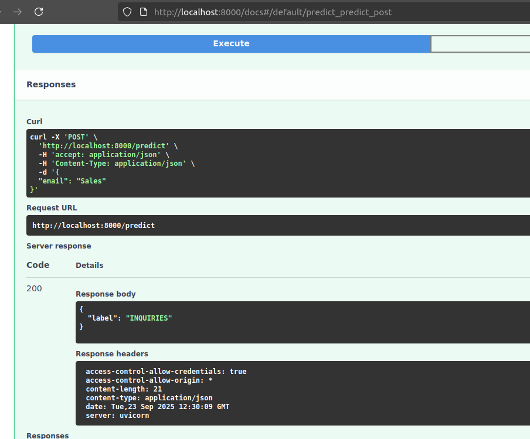

# Email Classifier API

A FastAPI-based API for classifying emails as Safe or Spam using zero-shot classification with a Hugging Face transformer model.

## Environment Configuration

To configure the environment for this project, create a `.env` file in the root directory with the following variable:

- `MODEL_NAME`: Specifies the Hugging Face model to use for classification. 

Example `.env` file:
```
MODEL_NAME=FacebookAI/roberta-large-mnli
```

## Framework and Stack Overview

- **Framework**: FastAPI - A modern, fast (high-performance) web framework for building APIs with Python 3.7+ based on standard Python type hints.
- **Machine Learning**: Hugging Face Transformers - Used for zero-shot text classification with the `FacebookAI/roberta-large-mnli` model (configurable via `.env`).
- **Environment Management**: `python-dotenv` - For loading environment variables from a `.env` file.
- **Server**: Uvicorn - An ASGI server implementation for running the FastAPI application.

## Code Structure

- **`src/main.py`**: Entry point for the FastAPI application, sets up middleware (CORS), and includes the classifier router.
- **`src/routers/classifier.py`**: Defines API endpoints for email classification and health checks using FastAPI's `APIRouter`.
- **`src/services/classifier.py`**: Implements the `ClassifierService` class as a singleton, utilizing Hugging Face's `pipeline` for zero-shot classification.
- **`src/dto/classifier.py`**: (Assumed) Contains data transfer objects (DTOs) for request and response models.
- **`src/enums/classifier_types.py`**: Defines the `EmailType` enum for classification labels (e.g., Safe, Spam).
- **`dataset/custom-dataset.csv`**: Contains sample email data for potential training or testing purposes.

## Usage

### API Endpoints

- **GET `/`**: Returns a welcome message.
- **GET `/liveness`**: Checks if the service is running (returns `{ "status": "ok" }`).
- **POST `/predict`**: Classifies an email text. Expects a JSON body with an `email` field and returns a JSON response with the predicted label.

Example POST request to `/predict`:
```json
{
  "email": "Deploy your project in one click..."
}
```
Response:
```json
{
  "label": "SUPPORT"
}
```


### Running the Application

1. **Install Dependencies**: Ensure you have Python 3.7+ installed, then run:
   ```
   pip install fastapi uvicorn transformers python-dotenv
   ```
2. **Start the Server**: Navigate to the `src` directory and run:
   ```
   cd src
   uvicorn main:app --reload --host 0.0.0.0 --port 8000
   ```
   This will start the server on `http://0.0.0.0:8000`. The `--reload` flag enables auto-reload during development.

3. **Access the API**: Open a browser or use a tool like Postman to interact with the API at `http://0.0.0.0:8000/docs` for the interactive Swagger UI.

## Development

### How to Contribute

1. **Clone the Repository**: If not already done, clone the repository to your local machine.
2. **Set Up a Virtual Environment** (optional but recommended):
   ```
   python -m venv venv
   source venv/bin/activate  # On Windows: venv\Scripts\activate
   ```
3. **Install Dependencies**: As shown in the Usage section.
4. **Make Changes**: Modify the code in the `src` directory as needed. Key files to focus on:
   - `src/services/classifier.py` for model logic.
   - `src/routers/classifier.py` for API endpoint definitions.
5. **Test Locally**: Run the server as described in Usage and test endpoints with tools like `curl` or Postman.
6. **Dataset**: Use `dataset/custom-dataset.csv` for testing or expanding the dataset for potential fine-tuning (not currently implemented).

### Running the Development Server

To run the development server with auto-reload for code changes:
```
cd src
uvicorn main:app --reload --host 0.0.0.0 --port 8000
```

### Additional Notes

- The current implementation uses zero-shot classification, which does not require training but may benefit from fine-tuning on `dataset/custom-dataset.csv` for better accuracy.
- Ensure you have sufficient memory as the `FacebookAI/roberta-large-mnli` model is resource-intensive.